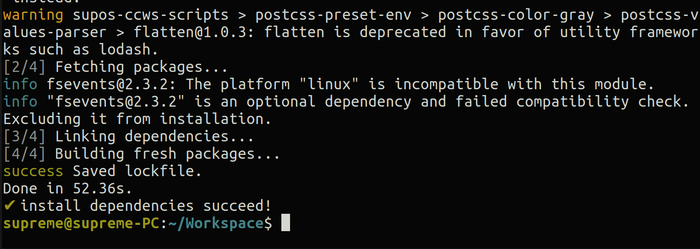
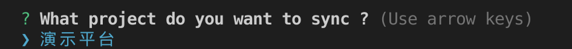
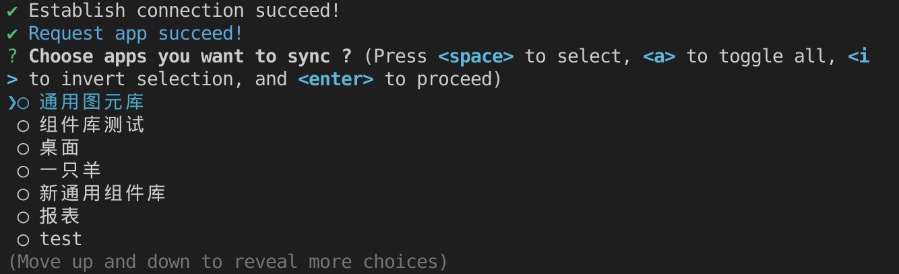
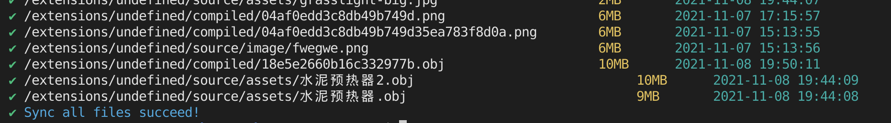
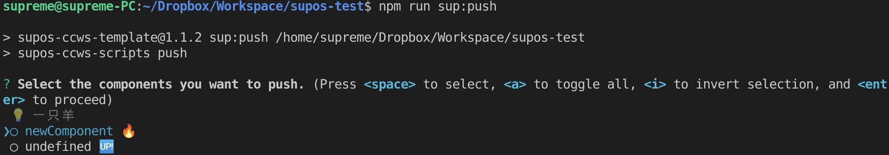
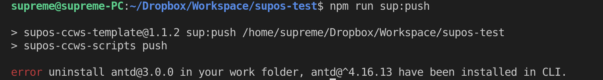
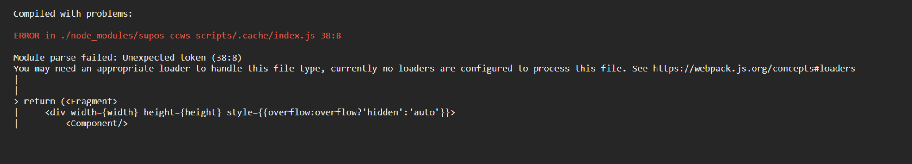

**适用版本**

| 平台  | 版本  |
| ----- | ----- |
| supOS | v3.0+ |

#### 说明

本工具为可编程组件的辅助开发工具

- 支持 css, scss, js ,ts 模块化
- 支持 多文件打包 静态资源打包
- 一键同步， 一键上传
- 支持 React 组件

#### 安装

```
npx supos-ccws-cli create [项目文件夹名称]
```

> 注意： create 不能缺少， 后面还需要加上文件夹的名称。

安装成功 

#### 目录结构

```bash
├── ccws.config.json                        // 项目配置文件
├── package.json                            // 项目依赖项
├── README.md
├── src
│   └── app1                                // app名称
│       ├── component1                      // 组件名称
│       │   ├── compiled                    // 组件编译目录，不需要人为修改
│       │   │   └── index.js                // 组件编译后入口文件，不需要人为修改
│       │   ├── dependencies.json           // supos平台默认依赖文件，不需要人为修改
│       │   └── source                      // 源文件目录
│       │       ├── index.js                // 入口文件，必须导出react组件，名称必须为 index.tsx 或 index.jsx，tsx 文件会优先查找
│       │       ├── style.module.scss       // 模块化样式文件
│       │       └── style.scss              // 非模块化样式文件
│       └── component2
│           ├── dependencies.json
│           └── source
│               └── index.js
└── package-lock.json                       // 版本锁定文件，不需要修改
```

#### 命令

```
// 拉取项目 需要配置 ccws.config.json
npm run pull
yarn pull

// 开启本地开发服务器
npm run dev
yarn dev

// 打包组件不推送至平台
npm run build
yarn build

// 打包组件并推送supos平台
npm run push
yarn push
```

#### 配置文件

> ccws.config.json

- 必须传入一个数组
- project: 项目名称 用于选择项目
- origi: 项目地址 协议:域名/ip:端口 例如： http://xxx.xxx.xxx:8080 <br></br>
  **注意:** origin 是唯一校验标识，不要重复
- username: 用户名称
- password: 密码
  **注意:** 开启加密登陆后,密码会被混淆,需要在浏览器的开发者工具,newwork 中查看 login 接口，使用加密后的密码

#### 拉取项目

- 选择项目



- 建立链接选择需要同步的 app,可以多选



- 同步后提示成功



#### 推送项目

- 新建的组件会有火焰的标志， 更新修改的组件会有 up 标志



#### CSS/SCSS 引用方法

- 全局引入

```javascript
import "./style.css";
import "./style.scss";
```

- 模块化引入,必须以 module.css 或 module.scss 结尾

```javascript
import Style from "./style.module.css";
import Style from "./style.module.scss";

<div className={Style.box}></div>;
```

#### 图片引入方式

```javascript
import bg from './bg.png'


<div style={{background:bg}}></div>
```

#### 内置第三方包

```json
{
  "react": "^17.0.2",
  "react-dom": "^17.0.2",
  "lodash": "^4.17.21",
  "antd": "^4.16.13",
  "moment": "^2.29.1",
  "scriptUtil": "*"
}
```

**以上第三方包不需要手动在开发环境中安装，如果安装了会报与环境依赖冲突的错误**



**其中 `lodash`,`scriptUtil` 全局引入不需要 import 导入即可以直接使用，如果导入会在线上运行时候报错**

**其余的依赖包都需要通过 import 导入后才能使用**

#### 开发注意事项

- 本地删除的文件，为了保证安全性不会在线上同步删除，如果想删除文件请在线上删除后在同步到本地
- 拉取文件会清空之前的工作区域，也就是 src 文件夹，请保证拉取前所有的文件都已经推送到线上，或已经转移到其他文件夹
- 不能在 src 目录下创建 App 文件夹，创建 App 只能在线上，本地创建会报错
- 组件不能是一个文件，请确保组件是一个文件夹，入口文件夹命名必须为 `source`文件夹下`index`，后缀名可以是 `.js .jsx .ts .tsx`,

#### 版本升级

- **2021-11-12**

  修复 npm 版本>= 8.1.0 命令报错 `Error: Cannot find module 'D:\vsCodeWorkspace\bi\demo\index-pull'`

- **2021-11-16**

  修复 windows 系统由于文件路径错误导致的不能解析的问题。

- **2021-11-24**

  不需要依赖 git 环境变量

  
