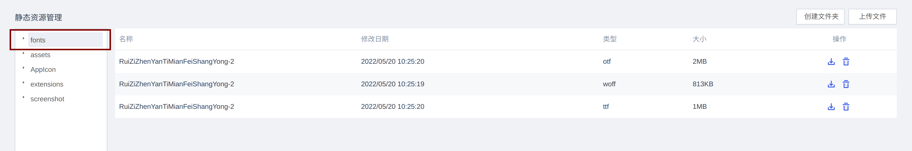

{/* [^_^]: ①②③④⑤⑥⑦⑧⑨⑩⑪⑫⑬⑭⑮⑯⑰⑱⑲⑳❶❷❸❹❺❻❼❽❾❿⓫⓬⓭⓮⓯⓰⓱⓲⓳⓴ */}

**适用版本**

| 平台  | 版本  |
| ----- | ----- |
| supOS | v3.0+ |

进入 [通用图元库](http://enginee-3.demo.devcloud.supos.net) 下载字体


解压出字体上传至需要使用字体的 App 中



在组态页面拖出标签控件,在加载事件中添加如下脚本

- 兼容 FontFace 的浏览器使用 FontFace 创建字体,如果不兼容需要使用 style 标签直接插入字体
- 组件设置中 **内容来源** 选择静态, 不要设置默认文本,因为会造成文字闪烁
- 字体加载完成后, 通过 scriptUtil 工具,动态添加文本

```js
var headers = new Headers({
  "Content-Type": "application/x-font-ttf",
});
fetch(
  "/resource/App_a12a1b5333b19ee933cc257f2bfcdc74/fonts/RuiZiZhenYanTiMianFeiShangYong-2.ttf",
  { headers }
)
  .then((res) => res.arrayBuffer())
  .then((buffer) => {
    if (window.FontFace) {
      var font = new FontFace("suposfont", buffer);
      document.fonts.add(font);
    } else {
      var css = document.createElement("style");
      css.innerHTML = `
            @font-face {
              font-family: "supofont";
              src: url('/resource/App_a12a1b5333b19ee933cc257f2bfcdc74/fonts/RuiZiZhenYanTiMianFeiShangYong-2.ttf') format('truetype');
            }`;
      document.getElementsByTagName("head")[0].appendChild(css);
    }
  })
  .then(() => {
    var css = document.createElement("style");
    css.innerHTML = `
        #htDiv-l384a3z30-179 .ant-spin-container div {
          font-family: "suposfont" !important;
          font-size: 80px !important;
          font-style: normal;
          -webkit-font-smoothing: antialiased;
          -moz-osx-font-smoothing: grayscale;
          background: linear-gradient(45deg, red,yellow, green);
          -webkit-background-clip: text;
          color: transparent !important;
    }`;
    document.getElementsByTagName("head")[0].appendChild(css);

    scriptUtil
      .getRegisterReactDom("htDiv-l384a3z30-179")
      .setLabelContent("标题文字");
  });
```


在实际开发中需要封装成函数, 并在正确的事件中调用，防止发生闪烁或重复请求。

```js
// 页面初始化事件
var loadFont = (fontName) => {
  var headers = new Headers({
    "Content-Type": "application/x-font-ttf",
  });

  var name = fontName.split(".")[0];
  var fonts;
  if (!(fonts = window._supOS_fonts_)) fonts = window._supOS_fonts_ = {};
  if (fonts[name]) return fonts[name];

  return (fonts[name] = fetch(
    `/resource/App_bac090d688004de9bf927b9ff66bfca7/assets/fonts/${fontName}`,
    { headers }
  )
    .then((res) => res.arrayBuffer())
    .then((buffer) => {
      if (window.FontFace) {
        document.fonts.add(new FontFace(name, buffer));
      } else {
        document.getElementsByTagName("head")[0].appendChild(
          (document.createElement("style").innerHTML = `
        @font-face {
          font-family: ${name};
          src: url('/resource/App_bac090d688004de9bf927b9ff66bfca7/assets/fonts/Din_Bold.ttf') format('truetype');
        }`)
        );
      }
      return name;
    }));
};
loadFont("Din_Bold.ttf");
```