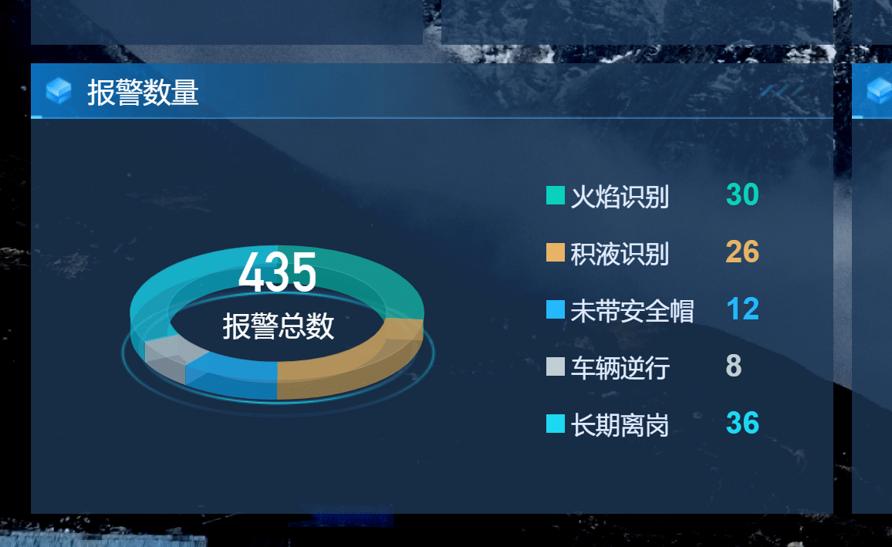

{/* [^_^]: ①②③④⑤⑥⑦⑧⑨⑩⑪⑫⑬⑭⑮⑯⑰⑱⑲⑳❶❷❸❹❺❻❼❽❾❿⓫⓬⓭⓮⓯⓰⓱⓲⓳⓴ */}

**适用版本**

| 平台  | 版本  |
| ----- | ----- |
| supOS | v3.0+ |

Highcharts 实现饼图鼠标悬浮时数据凸起, 代码需要使用 [可编程组件工具](/blog/custom-compnent-cli) 打包



```js
import React from "react";
import Highcharts, { chart } from "highcharts";
import highcharts3D from "highcharts/highcharts-3d";

highcharts3D(Highcharts);

export default () => {
  React.useEffect(() => {
    let data = [
      {
        name: "火焰识别",
        y: 30.0,
      },
      {
        name: "积液识别",
        y: 26.0,
      },
      {
        name: "未带安全帽",
        y: 12.0,
      },
      {
        name: "车辆逆行",
        y: 8.0,
      },
      {
        name: "长期离岗",
        y: 36.0,
      },
    ];
    data = data.map((d) => ({
      ...d,
      events: {
        click: function () {},
        mouseOut: function (point) {
          document.querySelector("#htDiv-lxybeoi70-1019").style.zIndex = 100;
          document.querySelector("#htDiv-lxybeoi70-524").style.zIndex = 100;
          point = point.target;
          point.graphic.attr({
            depth: 20 * 0.75,
            translateY: 0,
          });
        },
        mouseOver: function (point) {
          document.querySelector("#htDiv-lxybeoi70-1019").style.zIndex = 99;
          document.querySelector("#htDiv-lxybeoi70-524").style.zIndex = 99;

          point = point.target;
          var shapeArgs = point.shapeArgs;

          var rad = shapeArgs.end - shapeArgs.start;
          var depth = 20 + (rad / (2 * Math.PI)) * 60;

          point.graphic.attr({
            depth: depth,
            translateY: (-depth + 20 * 0.75) * Math.sin((65 / 180) * Math.PI),
          });
        },
      },
    }));
    Highcharts.chart("container", {
      chart: {
        type: "pie",
        panning: [0, 100, 0, 0],
        backgroundColor: "transparent",
        animation: true,
        options3d: {
          enabled: true,
          alpha: 63,
        },
      },
      title: {
        text: "",
      },
      credits: {
        enabled: false,
      },
      legend: {
        align: "right",
        verticalAlign: "top",
        layout: "vertical",
        symbolRadius: 0,
        x: 0,
        y: 10,
        useHTML: true,
        symbolWidth: 0,
        symbolHeight: 0,
        labelFormatter: function () {
          return `<div style="display:flex; align-items: center;margin-top:10px">
            <div style="width:12px;height:12px;background:${this.color};margin-right:4px"></div>
            <div style="color:#E2EDFF;font-size:16px;width:100px">${this.name}</div>
            <div style="font-size:20px;color:${this.color};font-weight: bold;margin-right:30px"">${this.y}</div>
          </div>`;
        },
      },
      navigation: {
        buttonOptions: {
          enabled: false,
        },
      },
      tooltip: {
        pointFormat: "{series.name}: <b>{point.percentage:.1f}%</b>",
      },
      plotOptions: {
        pie: {
          size: 190,
          allowPointSelect: false,
          showInLegend: true,
          cursor: "pointer",
          depth: 20,
          opacity: 0.8,
          innerSize: "75%",
          colors: ["#09D1BA", "#E6B465", "#1CB9FF", "#C2D0D5", "#1CD8F2"],
          dataLabels: {
            enabled: false,
          },
        },
      },
      series: [
        {
          type: "pie",
          name: "占比",
          data,
        },
      ],
    });
  }, []);
  return <div style={{ width: "520px", height: "256px" }} id="container"></div>;
};
```
