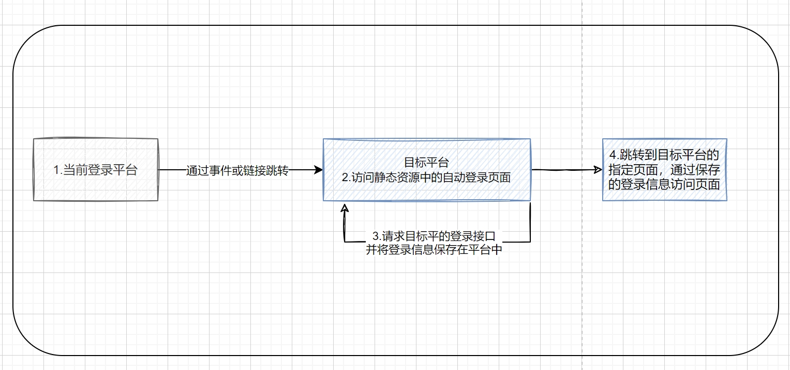
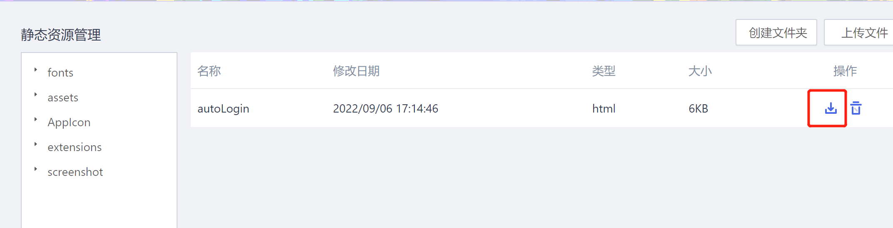
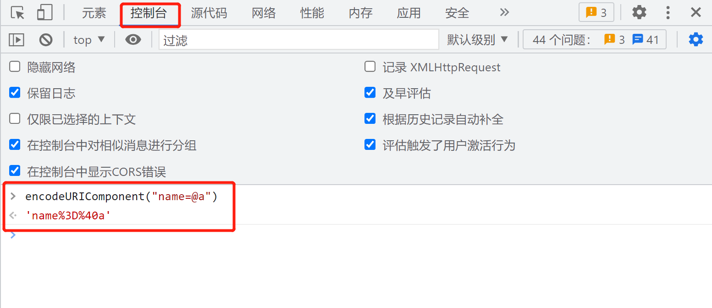

**适用版本**

| 平台  | 版本  |
| ----- | ----- |
| supOS | v3.0+ |

#### 适用场景

从当前登录 supOS 平台跳转到另一个 supOS 平台，希望不需要在目标平台上手动输入账号密码，可以自动完成登录并跳转到指定页面。

#### 流程

#### 使用方法

- 下载自动登录文件附件 <a download='auto-login.html' href="/static/highcharts72.js"/> ，无需修改，直接上传到目标平台 App 的静态资源中，可以是任意 App，路径没有限制，也可以直接放在静态资源根目录中，建议新建 App 并命名为自动登录方便查找

- 获取链接 ，在下载图标上右键选择 复制链接地址，记录好当前地址

  

- 在复制的链接地址后面拼上如下信息
  http://xxx.xxx.xxx/resource/App_xxxxxx/auto-login.html?username=xxx&password=xxx&redirect=xxx

  admin 目标平台用户名 
  passwork 目标平台密码 
  redirect 目标平台页面地址，地址通过在目标平台组态页面，在组态期中点击右上角预览，会打开一个新的预览页面，保存地址栏中的地址 

  注意：因为以上信息中可能包含特殊字符，确认是否包含@。.{} 等特殊字符，如果有通过以下方法转义. 
  打开一个空的浏览器页面按 f12 打开开发者工具  
  点击 console/控制台 标签，下面执行如下代码 encodeURIComponent("需要转义的信息")
  可以看见特殊字符已经被转义，复制结果加入到上面的链接中

  d

  此时直接打开拼接好的地址，可以发现能直接进入目标平台并正常访问页面,也可以在当前登录平台，通过按钮点击事件跳转到此链接
