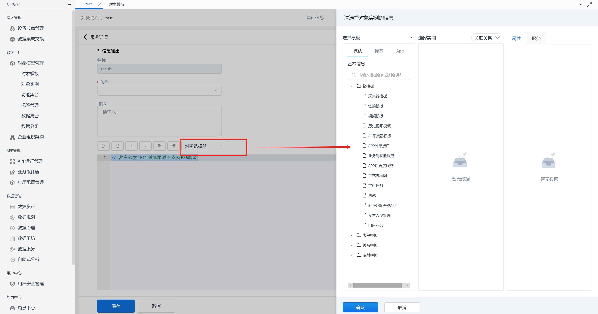
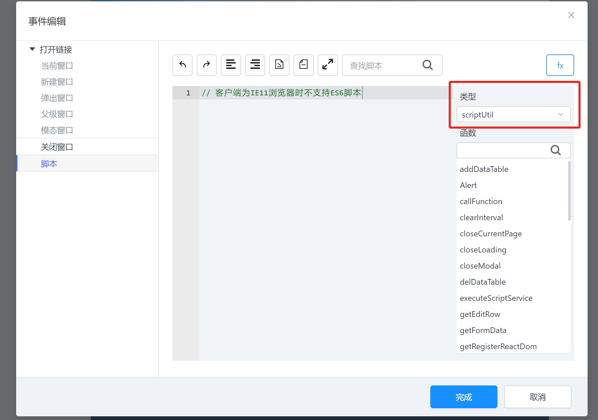
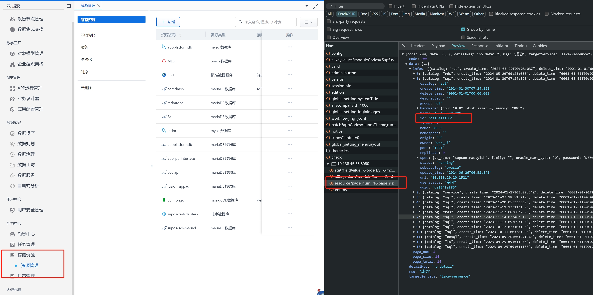
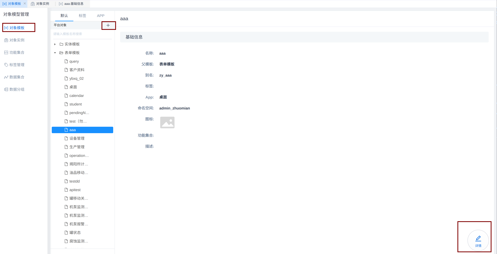
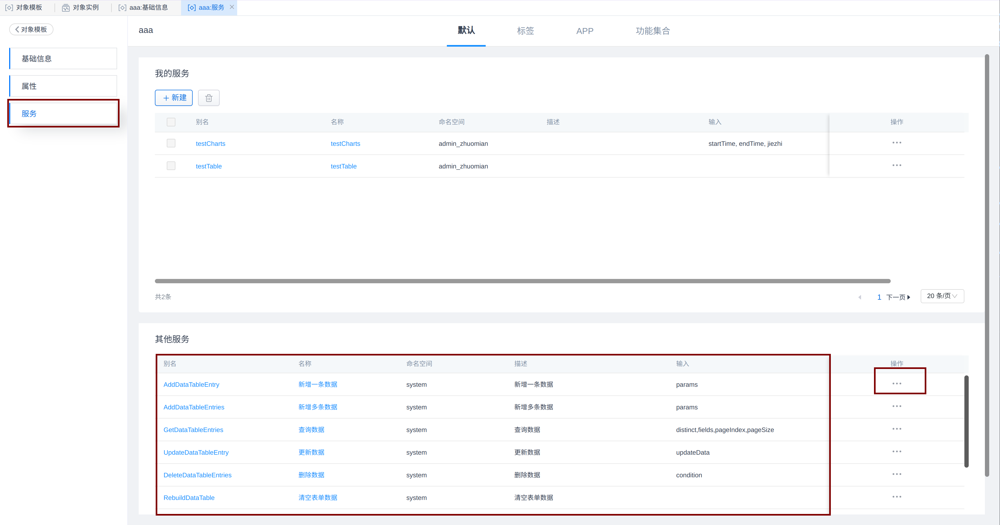
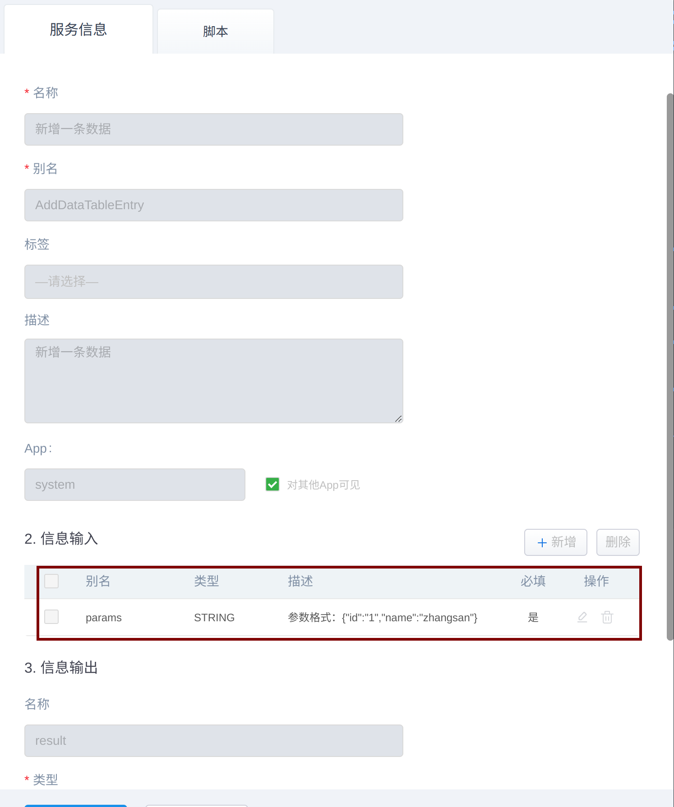

{/* [^_^]: ①②③④⑤⑥⑦⑧⑨⑩⑪⑫⑬⑭⑮⑯⑰⑱⑲⑳❶❷❸❹❺❻❼❽❾❿⓫⓬⓭⓮⓯⓰⓱⓲⓳⓴ */}

**适用版本**

| 平台  | 版本  |
| ----- | ----- |
| supOS | v3.0+ |

**更新: V4.2+ 版本中, oodm 服务可以通过在线选择模板生成，脚本中调用 oodm 服务也可以通过脚本中的内置模板生成。**





## OODM 中链接数据库, 实现增删改查

首先数据库需要在存储资源中注册。通过页面接口查看资源注册时的 id, 在 OODM 服务中可以通过指定 id 查询数据库。



```js
var header={
    "X-Tenant-Id":"dt"
}
var httpService = services["HttpClientService"];
var url = "http://compose-manage:8080/api/compose/manage/datatable/exec";

var param = {
    id: "接口中返回的数据库id",
    sql: "select * from some_table,
}
var res = httpService.post(url, JSON.stringify(param),header, 30000)
```

增删改操作需要切换为更新接口

```js
var http = services["Httpclientservice"];
var url = "http://compose-manage:8080/api/compose/manage/datatable/update/exec";

var param = {
  id: "接口中返回的数据库id",
  list: [
    { sql: "insert into user(name,age)values('zhangsan',20),('lisi',30)" },
    { sql: "update user set age = 22 where name = 'zhangsan'" },
    { sql: "delete from user where name ='zhangsan'" },
  ],
};
var res = httpService.post(url, JSON.stringify(param), 30000);
```

## OODM 请求第三方接口

```js
var httpClient = services.HttpClientService;

// get请求参数
httpClient.getString(String url);
httpClient.getString(String url, int timeout);
httpClient.getString(String url, Map header);
httpClient.getString(String url, Map header, int timeout);

// post请求参数
httpClient.post(String url, String body);
httpClient.post(String url, String body, int timeout);
httpClient.post(String url, String body, Map header);
httpClient.post(String url, String body, Map header, int timeout);

// put请求参数
httpClient.put(String url, String body);
httpClient.put(String url, String body, int timeout);
httpClient.put(String url, String body, Map header);
httpClient.put(String url, String body, Map header, int timeout);

// delete请求参数
httpClient.delete(String url);
httpClient.delete(String url, int timeout);
httpClient.delete(String url, Map header);
httpClient.delete(String url, Map header, int timeout);
```

示例

```javascript
// get
var url = "host://ip:port/path";
var result = services.HttpClientService.getString(url, 2000);

//post
var body = {
  key: "",
};
var url = "host://ip:port/path";
var result = services.HttpClientService.post(url, JSON.stringify(body), 2000);
```

## OODM 中如何调用平台内置服务

2.7 版本

```js
var inputs = {
  params: JSON.stringify({ id: "1", name: "zhangsan" }),
};
ObjectPool.get("对象实例别名").executeService(
  "内置服务(addDataTableEntry)",
  inputs
);
```

3.0 版本

```js
var inputs = {
  params: JSON.stringify({ id: "1", name: "zhangsan" }),
};
var instance = templates["对象模板命名空间.模板别名"].instances("对象实例别名");
var result = instance.executeService(
  "服务命名空间.内置服务(addDataTableEntry)",
  inputs
);
```

## 脚本中如何调用平台内置服务

2.7 版本使用方式

```js
scriptUtil.excuteScriptService(
  {
    objName: "对象实例别名",
    serviceName: "服务别名",
    params: {
      // "参数的值,可能是字符串,也可能是对象,按照服务参数说明填写"
    },
    cb: (res) => {
      // 执行结束后的回调函数,和下面方法二选一,写法不同,效果一样
    },
  },
  (res) => {
    // 执行结束后的回调函数
  }
);
```

3.0 及以上版本使用方式

```js
scriptUtil.excuteScriptService(
  {
    objName: "模板命名空间.模板别名",
    serviceName: "服务命名空间.服务别名",
    version: "V2",
    params: {
      // "参数的值,可能是字符串,也可能是对象,按照服务参数说明填写"
    },
    cb: (res) => {
      // 执行结束后的回调函数,和下面方法二选一,写法不同,效果一样
    },
  },
  (res) => {
    // 执行结束后的回调函数
  }
);
```

查看服务参数

点击对象模板 -> 添加按钮,创建表单 -> 点击进入详情



点击服务 -> **其他服务就是平台内置服务** -> 点击操作中的查看



在 信息输入 描述中查看参数格式, 别名就是参数的 `key` 描述就是值的格式


