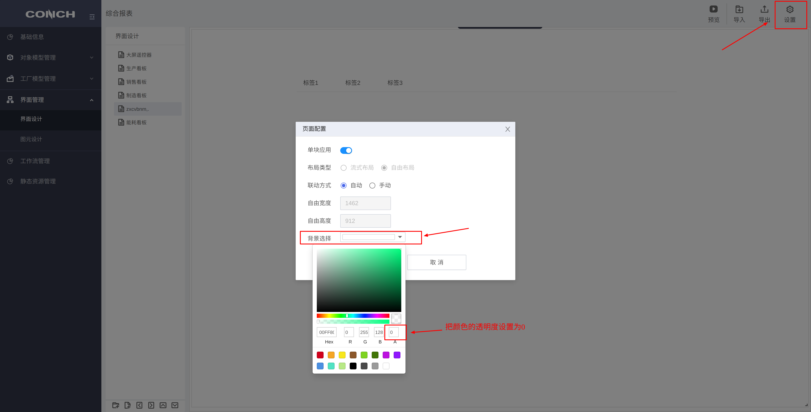
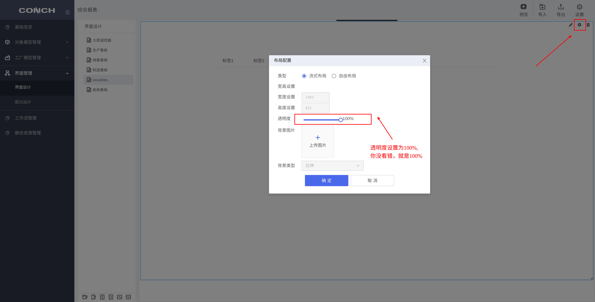
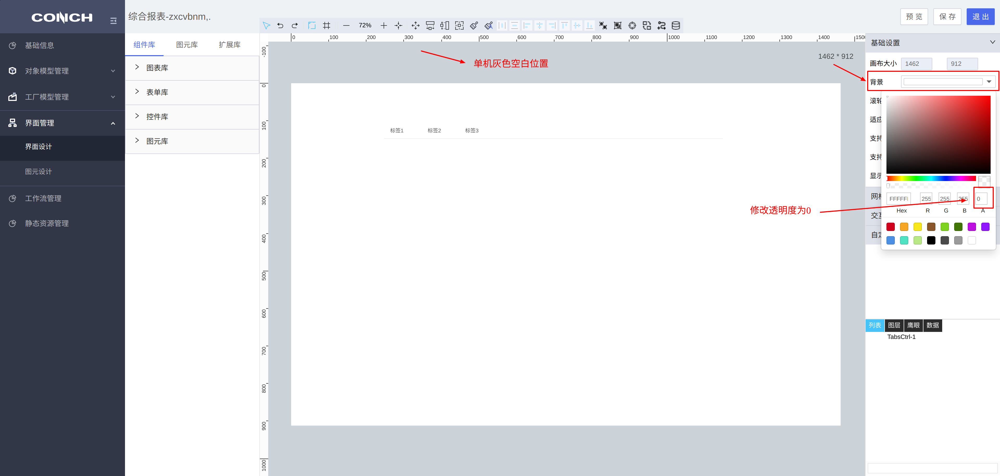
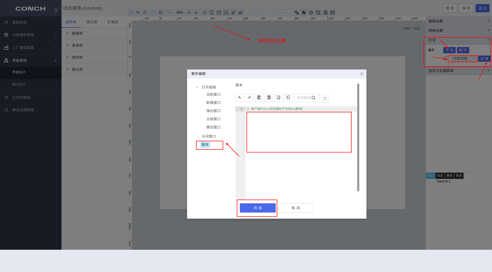

{/* [^_^]: ①②③④⑤⑥⑦⑧⑨⑩⑪⑫⑬⑭⑮⑯⑰⑱⑲⑳❶❷❸❹❺❻❼❽❾❿⓫⓬⓭⓮⓯⓰⓱⓲⓳⓴ */}

**适用版本**

| 平台  | 版本  |
| ----- | ----- |
| supOS | v3.0+ |

经常在其他页面引用当前设计好的页面会存在背景色不透明的情况，首先需要在三个地方设置透明度，如果不能解决尝试添加最后的脚本。

① 修改设计界面的透明度



② 修改布局配置中的透明度



③ 双击界面或点击右上角笔的图标进入设计器，点击一下空白的灰色画布位置，修改画布的透明度



④ 如果上述设置后不能解决，尝试在需要透明的页面中设置脚本来解决

打开需要让背景变透明的页面，添加以下脚本



```javascript
document.querySelector("body .ant-layout").style.background = "transparent";
document.querySelector("body").style.background = "transparent";
```
