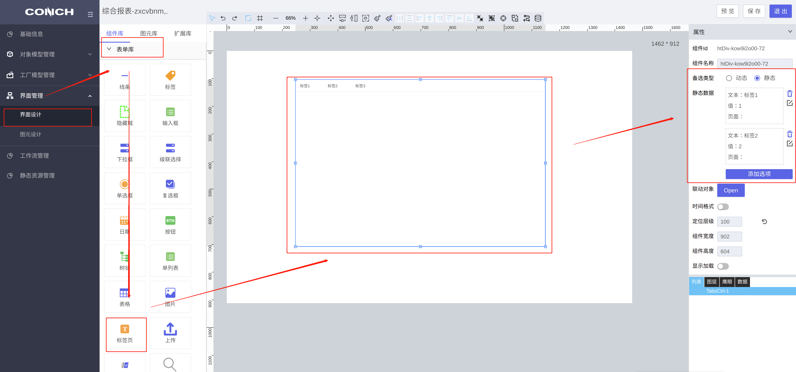
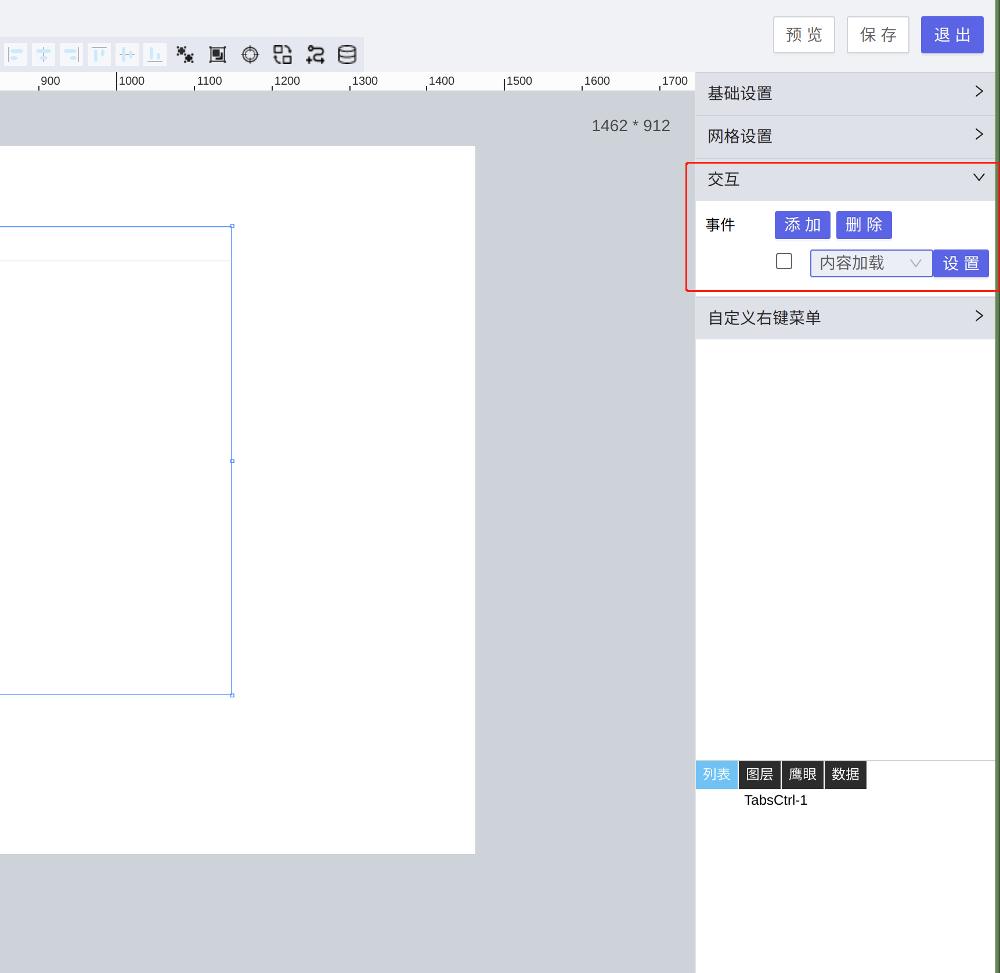
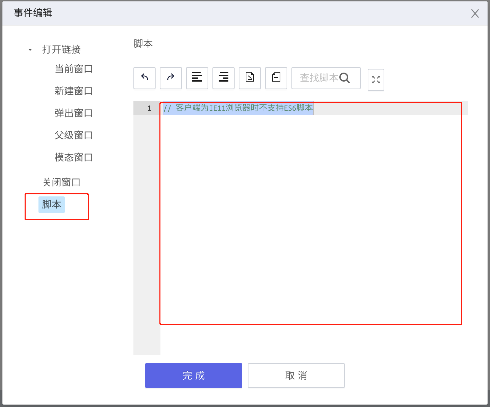

{/* [^_^]: ①②③④⑤⑥⑦⑧⑨⑩⑪⑫⑬⑭⑮⑯⑰⑱⑲⑳❶❷❸❹❺❻❼❽❾❿⓫⓬⓭⓮⓯⓰⓱⓲⓳⓴ */}

**适用版本**

| 平台  | 版本  |
| ----- | ----- |
| supOS | v3.0+ |

① 在界面设计->表单库中找到标标签页组件，拖到画布中并配置数据



② 交互事件中添加**内容加载事件**



③ 点击设置在脚本中添加如下代码并点击完成保存代码



查看组件 ID 并复制，替换调下面代码中的组件 ID，**注意：组件 Id 前面的#不能省略，和组件 ID 之间不能有空格**

```javascript
// 修改tab标签的字体颜色
document.querySelector("#组件Id .ant-tabs").style.color = "red";

// 修改正在激活的标签的字体颜色
document.querySelector(
  "#组件Id .ant-tabs .ant-tabs-nav .ant-tabs-tab-active"
).style.color = "blue";

// 修改正在激活标签的背景颜色
document.querySelector(
  "#组件Id .ant-tabs .ant-tabs-nav .ant-tabs-tab-active"
).style.background = "blue";

// 修改标签栏（整行）的背景颜色
document.querySelector("#组件Id .ant-tabs-nav-wrap").style.background = "blue";
```
