**适用版本**

| 平台  | 版本  |
| ----- | ----- |
| supOS | v3.0+ |

## 1. 组件位置

首先联系项目经理获取蓝湖的账号和密码。

**确认设计稿像素,与 supos 设计器中画布的尺寸保持一致**。


蓝湖中图层的标注,实际是此图层**左上角到定边或左边的距离,与平台元素定位逻辑不同**

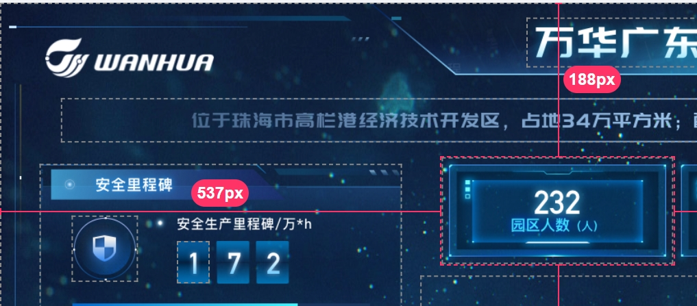

平台中元素的的坐标表示的是元素中心点的位置， 因此从设计稿转化为 supos 画布坐标的方法是: **设计稿 X(横)坐标 + 设计稿元素(Width)宽度 /2, 设计稿 Y(纵)坐标 + 设计稿元素(Height)高度 /2**

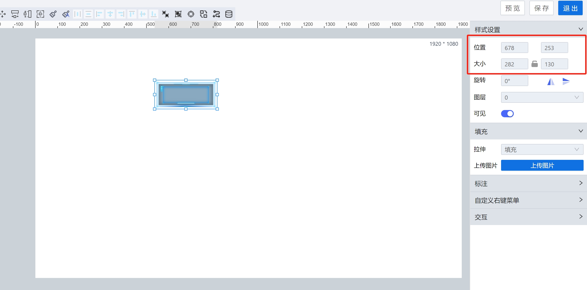

## 2. 样式覆盖

需要对默认组件覆盖样式，统一写到画布初始化事件中，页面加载时优先处理样式脚本

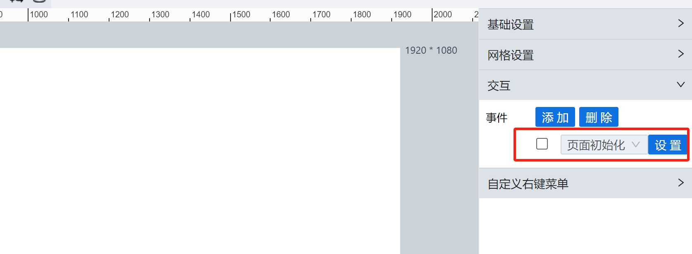

添加覆盖脚本

```js
var style = document.createElement("style");
style.innerHTML = `
body { background-color: red; }

#htDiv-lqlv72zk0-582 .antd-table {

}
`;
document.head.appendChild(style);
```

**注意： 覆盖组件样式时，一定要添加组件 ID，作为 css 选择器，避免造成全局样式的污染**

## 3. 基础图表样式

基础图表样式配置，必须使用组件自带属性

常用的数据渐变色，网格线，刻度等调整参数都已经支持。

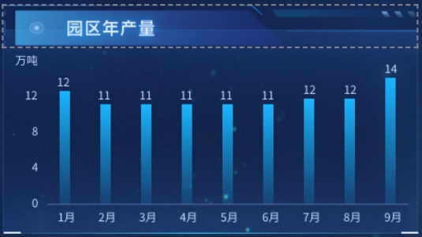

## 5. 动图使用

在 <a href="https://gc-supos.tss.supos.net/main/?oKey=&sKey=3258850999228290&appid=3258850999228288#/runtime-fullscreen/runtime-fullscreen/Page_7270ad0d5294441b9b0448a3f8a9b4d9" target="_blank">图元库</a> 中下载 (开发者 账号:gongcheng 密码:Supos1304@), 或使用 UI 提供的动图。

动图数量不宜过多。

## 5. 组件拆解案例 1

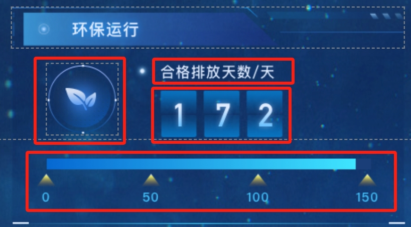

数字与进度条使用可编程组件实现，logo 和 文字 使用平台组件实现。

## 6. 组件拆解案例 2

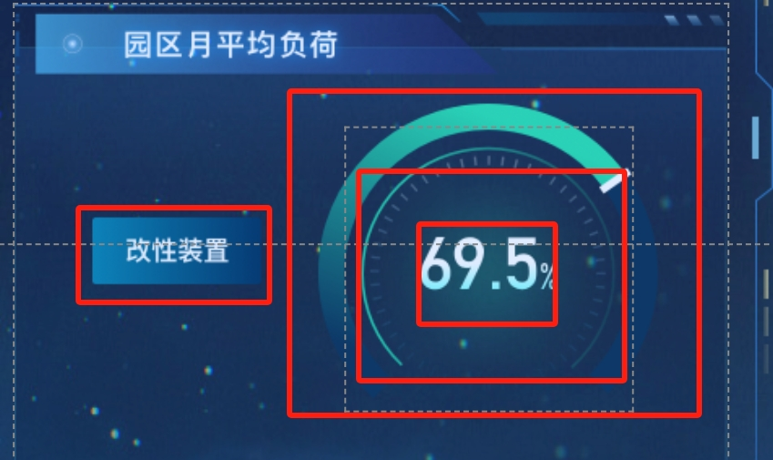

数字与表盘刻度使用标签组件以及图片组件实现，环形图使用组件库中仪表盘实现。

**组件拆解的逻辑是，尽可能将组件拆小，尽可能使用平台的组件。**

## 7. 组件层级问题

**所有的图元库中的组件都无法放到表单组件上面。**

典型场景是使用表单库中的图片，和图元库中图片的区别：

- 图元库图片最终会绘制在 canvas 中，不是单独的元素
- 组件库图片是 img 元素，是一个单独的 html 元素

最佳实践：

- **背景图片必须使用图元图片**，如果使用表单图片将导致 DataLink 等图元的元素无法放到背景图之上。
- **有图片切换的场景，必须使用表单库中的图片**，例如点击不同的设备切换不同图片。

## 8. 组件功能扩展

通过脚本扩展组件的功能，包括但是不限于以下的场景：

- 需要通过脚本与其他组件联动
- 需要通过脚本扩展图表等组件的功能
- 需要脚本扩展组件的交互事件，如点击事件等

扩展脚本必须写在组件的内容加载事件中，保证组件加载后才执行

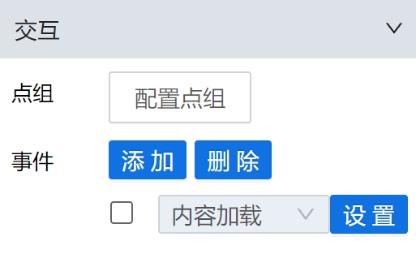

## 9. 可编程组件使用

**尽量避免使用可编程组件，以免增加了项目维护的复杂性**。

对于必须使用可编程组件实现的图表，如果单个组件文件数唯一，功能单一，推荐使用线上编辑的功能（也可以在本地 IED 工具开发好，复制到线上）。

如果使用 highcharts 库开发，建议参考 <a href="https://gc-supos.tss.supos.net/main/?oKey=&sKey=2650236477264048&appid=2650236475363504#/runtime-fullscreen/runtime-fullscreen/Page_7270ad0d5294441b9b0448a3f8a9b4d9" target="_blank">组件库</a> (开发者 账号:gongcheng 密码:Supos1304@) 中的代码实现方式。开发前请详细阅读 <a href="https://gc-supos.tss.supos.net/main/?supmenuhash=1680238413130#/runtime-fullscreen/runtime-fullscreen/Page_927e71788d094b1494252edf9af98f70" target="_blank">文档</a>

如果可编程组件比较复杂，需要分文件夹，或多级目录，或需要自定义打包资源，例如模型文件，推荐使用 [可编程组件开发的脚手架工具](/blog/custom-compnent-cli)

## 10. 可编程组件配合 svg 实现定制化的组件

有一些组件在常规的图表库或原生 js 很难实现，例如如下的组件

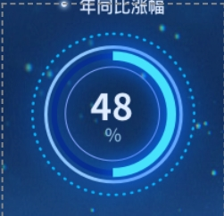 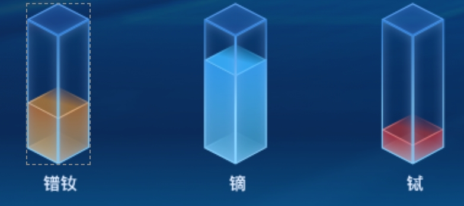

此类组件可以要求 UI 提供 svg 导出文件, 在可编程组件中动态修改 svg 元素。可以参考 [SVG 环形进度条](/blog/svg-chart-custom-component)

## 11. 解决小尺寸分辨率图表鼠标偏移的问题

- 问题原因：平台依赖的 highcharts 版本过低
- 解决方法：使用高版本的 highcharts 库，在组件加载后用加载后的数据重新绘制.

- 在系统配置/业务设计器配置

  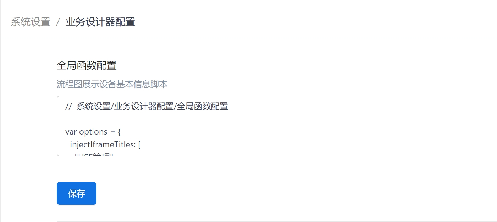

  ```js
  //  系统设置/业务设计器配置/全局函数配置

  var options = {
    injectIframeTitles: [
      "HSE管理",
      "运营总览图",
      "生产管理",
      "供应链",
      "质量管理",
      "能耗监控",
      "设备管理",
      "改性",
      "水性",
      "生产监控",
      "事业部",
      "运营平台",
    ],
    injectScripts: [
      "/resource/App_35a687c57d8c5eaa7efe8b146482c19d/highcharts72.js",
    ],
  };

  (function (w, options) {
    var injectIframeTitles = options.injectIframeTitles || [];
    var injectScripts = options.injectScripts || [];

    function isIframe() {
      return w !== w.parent;
    }

    function inject() {
      var i = 0;
      var promises = [];
      for (; i < injectScripts.length; i++) {
        var script = document.createElement("script");
        script.src = injectScripts[0];
        script.type = "text/javascript";
        w.document.head.appendChild(script);

        promises.push(
          new Promise(function (resolve) {
            script.onload = resolve;
          })
        );
      }

      return Promise.all(promises);
    }

    var scriptsPromise = null;
    if (isIframe()) {
      var iframe = window.parent.document.querySelectorAll("iframe");
      var i = 0;
      for (i = 0; i < iframe.length; i++) {
        if (iframe[i].contentWindow !== w) continue;
        var iframeTitle = iframe[i].title;
        for (i = 0; i < injectIframeTitles.length; i++) {
          var titleName = injectIframeTitles[i];
          if (iframeTitle.indexOf(titleName) < 0) continue;
          scriptsPromise = inject();
        }
      }
    }

    if (!scriptsPromise) return;

    w.highchartsRerender72 = function (id) {
      if (window.top === window) return;

      scriptsPromise.then(function () {
        const Highcharts = Highcharts72;

        var chart = scriptUtil.getRegisterReactDom(id).getCurrentInstance();

        chart.options.series = chart.series.map(function (series) {
          return series.options;
        });

        const chartsContainer = document.querySelector(
          "#" + id + " div[id*='ighcharts']"
        );

        const parentElement = chartsContainer.parentElement;

        chartsContainer.parentElement.removeChild(chartsContainer);

        var chart72 = Highcharts.chart(parentElement, chart.options);

        var instance = null;
        if ((instance = window.COMPVIEW.dynamicImportWidget[id])) {
          instance.chartInstance = chart72;
        }
        var timer = 0;
        w.addEventListener("resize", function () {
          clearTimeout(timer);
          timer = setTimeout(chart72.render.bind(chart72), 500);
        });
      });
    };
  })(window, options);
  ```

脚本中依赖高版本的 <a download='highcharts72.js' href="/static/lib/highcharts72.js">highcharts</a> 库,下载后上传到当前项目的静态资源中,并修改上面脚本中的路径

injectIframeTitles 数组表示标签页的名称, 修改为相应的标签页名称,让脚本在指定的标签页中生效, 如下图

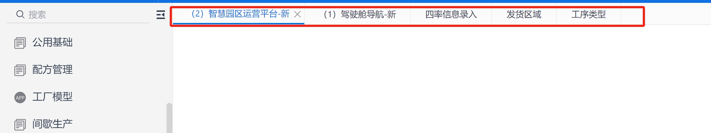

在设计器中有问题的图表组件**接口加载完成后事件**中,添加以下脚本以便重新绘制图表

```js
window.highchartsRerender72 && window.highchartsRerender72(传入组件ID);
```

## 12. 服务/页面脚本 历史记录

开发过程中服务/页面脚本,如果被覆盖很难找回, 强烈建议开发者安装 [suoOS autosave chrome extension](/blog/supos-autosave) 自动记录服务提交历史的插件
